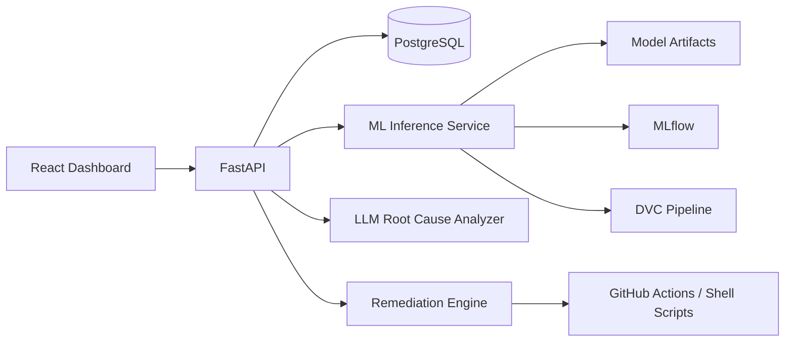

# Architecture

## Flow

1. Metrics are generated or ingested and stored in PostgreSQL.
2. The ML service predicts normal, warning, or critical states.
3. High-risk events create incidents and trigger root-cause analysis.
4. Recommendations are converted into simulated remediation actions.
5. The dashboard shows risk, incidents, model metrics, and action history.
